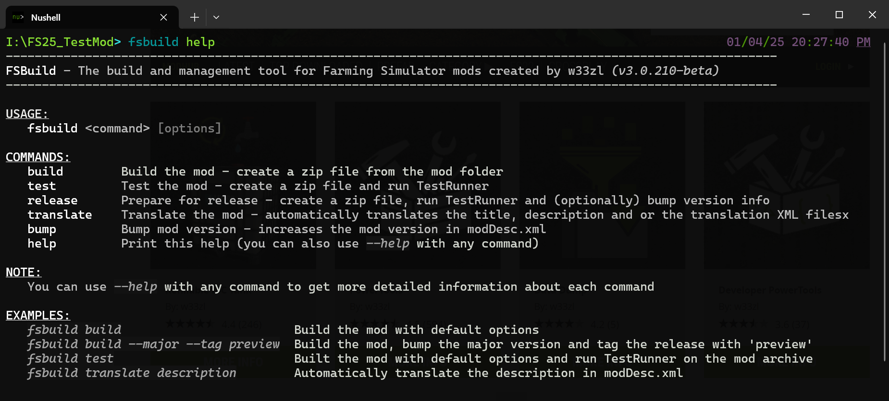
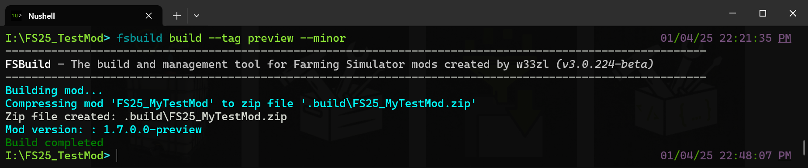
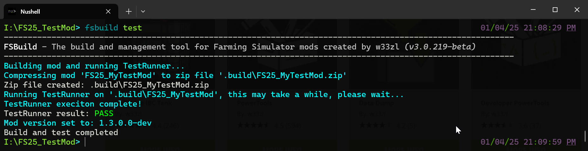
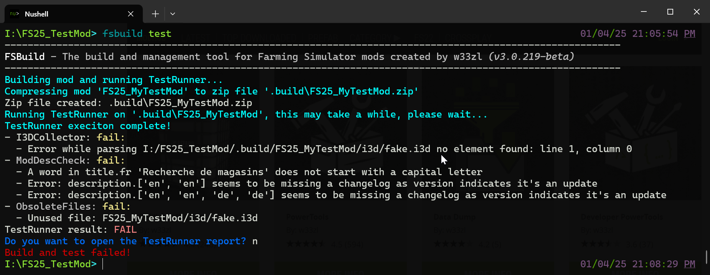
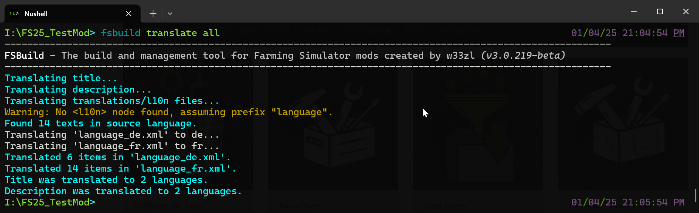

# FSBuild - The build and management tool for Farming Simulator mods

The command line tool, **`fsbuild`**, assist you in managing your mod project and prepare your mod for submitting it to ModHub (and releases on other platforms). The tool simplifies and speed up some of the less creative and tedious tasks associated with modding for Farming Simulator, e.g. like creating your zip archive, convert images or run TestRunner. Think of it like a quality-of-life "swiss army tool" for FS modding.




Commands: [build](#build) | [test](#test) | [release](#release) | [bump](#bump-majorminorpatch) | [translate](#translate)

For more details on each subcommand, see separate sections below.

**Quick links:**
* [Installation instructions](#installation-instructions)
* [How to use FSBuild](#how-to-use-fsbuild)
* [Mod project configuration](#the-fsbuild-project-configuration-file-fsproj)

## Features

* Builds a zip archive from your mod folder (with support for blacklisting files to be excluded)
* Run TestRunner tool on your zip archive (this is important to ensure exactly the right files are included in the zip file)
* Translate title, description and/or all language_XX.xml files. This uses DeepL AI based automagic translations. Supports EN, DE and FR currently.
* Bump mod version version number (can be executed separately or as part of the build process)
* Tag builds - adds a prefix to mod title and a suffix to the version, e.g. to indicate preview versions or GitHub specific releases

### Planned features
These features are planned, but it is not certain when (if ever) I actually make it to that point :) 
* Automatically install/update TestRunner tool
* Automatically bump modDesc version to latest known version
* Tools for working with mod related images, e.g. converting to proper format for mod icon etc
* and more..


## How to use FSBuild

```
USAGE:
   fsbuild <command> [options]

COMMANDS:
   build        Build the mod - create a zip file from the mod folder
   test         Test the mod - create a zip file and run TestRunner
   release      Prepare for release - create a zip file, run TestRunner and (optionally) bump version info
   translate    Translate the mod - automatically translates the title, description and or the translation XML filesx
   bump         Bump mod version - increases the mod version (major, minor or revision) and updates the modDesc automatically
   help         Print the help text (you can also use --help with any command)
```

Each subcommand might have additional options, these can be printed using the `--help` flag, e.g. `fsbuild build --help`.


### `build`
Compresses the mod folder into a zip archive ready for ModHub/distribution. Supports files/folder to be excluded via a blacklist. See the [configuration settings](#the-fsbuild-project-configuration-file-fsproj) for the `.fsproj` file below.

The output zip archive will be named according to the variable `name` from the [project settings](#the-fsbuild-project-configuration-file-fsproj), e.g. if `name` is _'MyTestMod'_ the output file will be `FS25_MyTestMod.zip`. In addition to this file, a copy named `FS25_MyTestMod_update.zip` will be generated as well to make it easy to upload updates to ModHub.

#### The `build` command have the following options (also applies to `test` and `release`):
|Option|Explanation|
|-|-|
|`--bump <major/minor/patch>`|Bumps the mod version (either the major, minor or patch part), for more details see the `bump` command below|
|`--tag <yourTag>`|Prefixes the title with the tag (e.g. `[YOURTAG] YourModName`) and add a suffix to the version string (e.g. `1.0.0.0-yourtag`|
|`--major`|Alias for `--bump major`|
|`--minor`|Alias for `--bump minor`|
|`--patch`|Alias for `--bump patch`|

_**Note:** Bumping version is temporarily done before archiving the mod, however the change will not be permanent (saved to `modDesc.xml`) if the build (or test) fails._



### `test`
Same as the `build` command, but also decompresses the zip archive and then run the TestRunner tool on these file. 

_It is important that this is an unzipped version of the zip archive and not the original mod folder since some files should be excluded from the zip archive._

The test command relies on the externa tool TestRunner from Giants. Please refer to the [configuration section](#configuration-optional-recommended) for detailed instructions on how to enable this feature.

#### Quick test summary
After the completed execution of TestRunner you will get an overview of the outcome.

_Successful TestRunner test:_


_Failed TestRunner test:_


If the test did fail, FSBuild will show a red "FAIL" text as well as ask if you want to automatically open the test report (which is not needed when the test passed). In most cases you don't need to review the report since most of the information is already present in the console. 

### `release`
Same as the `test` command, but with additional features to automatically bump mod version and update modDesc version to latest known version. 

This build mode could also in the future apply additional rules to conform with ModHub or other specific changes desired release specific settigns (could e.g. be a flag `--preview` to generate a special mod title and mod version to indicate that is is a preview release). However, these features are not yet in place.

#### Bumping version
When executing the release command, if the `--bump <segment>` parameter is omitted, FSBuild will ask if you want to automatically bump the version. I.e. you can either just answer the question or explicitly add it via the `--bump` flag. 

_**Note:** Regardless which option you choose, if you by any means have chosen to bump the version, this will **only** happen if TestRunner tests is **successful**._

### `bump <major|minor|patch>`
Bumps the mod version number and updates `modDesc.xml`. The `bump` command expects the version segment name as the first parameter, e.g. `bump major`.

#### The `bump` command accepts the following parameters:
|Parameter|Explanation|
|-|-|
|`major`|Bumps the major part of the mod version, e.g. from `1.0.0.0` to `2.0.0.0`. This also resets both minor and patch to 0, e.g. `1.1.1.0` will be `2.0.0.0` |
|`minor`|Bumps the minor part of the mod version, e.g. from `1.1.0.0` to `1.2.0.0`. This also the patch part to 0, e.g. `1.1.1.0` will be `1.2.0.0` |
|`patch`|Bumps the patch/revision part of the mod version, e.g. from `1.0.1.0` to `1.0.2.0`. |

_**Note:** all three commands will reset build version to 0._


### `translate`



With the translate command you can automatically translate parts of your mod based. Currently, only EN, DE and FR are supported. Depending on which language you choose as source language, the automatic translation will translate to all other supported languages (currently EN, DE,and FR). Let's assume that you choose DE as source language, this means all translation will be in EN and FR.

The translate command has these subcommands:
- `title`: Translate the mod title from modDesc.xml. Does not overwrite existing titles.
- `description`: Translate the description from the modDesc.xml. Overwrites existing descriptions.
- `files`: Translates all the 'language_XX.xml' files. Does not overwrite existing nodes in these files.
- `all`: Executes all three sub commands above

> Note: This feature requires a DeepL API key, it is easy to get one for free. See section [configure FSBuild](#configuration-optional-recommended) for instructions.

## The FSBuild project configuration file (*.fsproj*)

In essence, the .fsproj file is a JSON file looking like this:
```json
{
    "name": "FS25_ExampleMod",
    "sourceLanguage": "en",
    "excludeFiles": [
      "**/*.pdn" // Exclude all .pdn image files from the final archive
    ],
}
```

The project configuration file is not needed to run the tool, if it is missing it will be created on the first run. The configuration file has the following items:

* **name:** The name of your mod, will be the name of the output zip archive
* **sourceLanguage:** The language to translate _from_. Currently supports EN, DE and FR. This means that if DE is the sourceLanguage, the translations will be in EN and FR. If omitted, EN will be chosen as source language.
* **excludeFiles:** An array of file and folder names/patterns to be excluded from the zip archive. You can use exact paths (e.g. `modDesc.xml`) or wildcard patterns (e.g `**/myFile.txt`). Each path/pattern should be enclosed in double quotes and separated by a comma, e.g. `[ "pattern1", "path1", "pattern2" ]`

_**Note:** The `.fsproj`, `fsbuild` and your zip file will be automatically added to the blacklist and is not needed in the 'excludeFiles' section._

## Installation instructions
Follow the instructions below to install FSBuild on your system. The only real mandatory step is the first two steps, the tool will work after this (with limitations). However, to get a full installation it is recommended to also follow the optional steps 3-6:

1. Download the latest version of FSBuild from [w33zl.itch.io/fs-build](https://w33zl.itch.io/fs-build)
2. **Unzip** the contents of the fsbuild.zip archive into any folder (from now on called _'installation folder'_ )
3. Add the path to the _installation folder_ in your **environment variables** (see [detailed instructions]() below)
4. Create the `fsbuild.ini` in your `%localappdata%\fsbuild` folder 
   1. The easiest way is to run `fsbuild` from your terminal/command prompt and let the program automatically create the file for you. If the file doesn't already exists, you will be offered to have the file created for you and opened in Notepad. This is the quickest and easiest method.
   2. If the automatic process fails, or if you for any reason want to do this manually, open the `%localappdata%` folder on your computer (e.g. `C:\User\NAME\AppData\Local`), and ensure the folder `fsbuild` exists. Then create a new empty text file named `fsbuild.ini`.
5. Edit the `fsbuild.ini` from the previous step to **configure FSBuild** (see [configuration section](#configuration-optional-recommended) below for details)
   1. Enable automatic translations with DeepL by providin an API key (it is easy and free)
   2. Enable automatic testing with TestRunner (two simple steps)
6. **Run the command** `fsbuild help` to ensure the installation is ok, if you see usage instrucitons everything is good

Note: If you don't want to change your environment variables, you can instead unzip the fsbuild.exe to your mod folder, however that is not recommended. You could also skip setting up environment variables and just use the full path each time you execute the fsbuild command (e.g. `C:\YourPath\fsbuild <command>`), while not convinient it works at least.

### Add environment variables (optional, recommended)
The benefit of adding your _installation folder_ to your environment variables is that the `fsbuild` command will be available in any folder and you can easily use it in any current or future mod folder. And as long as you replace the files in the same location on future updates of FSBuild, you don't need to ever change the environment variables, it will just work.

To add or change the environment variables for FSBuild, follow these steps:
1. Open your start menu and search for 'envir' and you should see an _"Edit the system environment variables"_ [[screenshot](https://github.com/w33zl/FSBuild/blob/master/images/w33zl_fsbuild_environment_variables_search.jpg?raw=true)]
2. Click on _"Edit the system environment variables"_
3. Click on the button "Environment Variables" [[screenshot](https://github.com/w33zl/FSBuild/blob/master/images/w33zl_fsbuild_environment_variables_open.jpg?raw=true)]
4. Now you should add a `Path` variable, you can choose either A) a _system variable_ (works for all users), or B) a _user variable_ (only works for current user)
   * Add a _**User variable**_ (less risk, but only works for current user):
      1.  Click the "New..." button below the list of _"User Variables for [NAME]"_ [[screenshot](https://github.com/w33zl/FSBuild/blob/master/images/w33zl_fsbuild_user_environment_variables_step1.jpg?raw=true)]
      2.  In the _Edit User Variable_ popup window, set the name to `FSBuild` and the _Variable Value_ to your _installation folder_ path (e.g. `C:\Program Files (x86)\Farming Simulator 2025\fsbuild`) [[screenshot](https://github.com/w33zl/FSBuild/blob/master/images/w33zl_fsbuild_user_environment_variables_step2.jpg?raw=true)]
      3.  Click Ok
   *  _**Option A)**_ Add a _**System variable**_ (higher risk of errors, but works for all users):
      1.  Look in the list _"System Variables"_ for an item named `PATH` [[screenshot](https://github.com/w33zl/FSBuild/blob/master/images/w33zl_fsbuild_system_environment_variables_step1.jpg?raw=true)]
      2.  Click the "Edit..." button
      3.  In the popup window, click the "New..." button [[screenshot](https://github.com/w33zl/FSBuild/blob/master/images/w33zl_fsbuild_system_environment_variables_step2.jpg?raw=true)]
      5.  Paste in the path to your _installation folder_ (e.g. `C:\Program Files (x86)\Farming Simulator 2025\fsbuild`) [[screenshot](https://github.com/w33zl/FSBuild/blob/master/images/w33zl_fsbuild_system_environment_variables_step2.jpg?raw=true)]
      6.  Click Ok
      7.  Click Ok
   *  _**Option B)**_ Add a _**User variable**_ (works only for current user, but less risk of messing things up for other users):
      1.  _(the steps are almost identical to setting up a System variable, see screenshot for the Option A for guidance)_
      2.  Look in the list _"User Variables for {USERNAME}"_ for an item named `PATH`
      3.  Click the "Edit..." button
      4.  In the popup window, click the "New..." button
      5.  Paste in the path to your _installation folder_ (e.g. `C:\Program Files (x86)\Farming Simulator 2025\fsbuild`)
      6.  Click Ok
      7.  Click Ok
5. After you have added a user or system variable, you need to logout of your system for the changes to have effect
6. Open a terminal window/command prompt, open any folder (except the _installation folder_) and try the `fsbuild` command.

[](https://github.com/w33zl/FSBuild/blob/master/images/w33zl_fsbuild_environment_variables_search.jpg?raw=true)
[](https://github.com/w33zl/FSBuild/blob/master/images/w33zl_fsbuild_environment_variables_open.jpg?raw=true)
[](https://github.com/w33zl/FSBuild/blob/master/images/w33zl_fsbuild_system_environment_variables_step1.jpg?raw=true)
[](https://github.com/w33zl/FSBuild/blob/master/images/w33zl_fsbuild_system_environment_variables_step2.jpg?raw=true)

### Configuration (optional, recommended)
While these steps is also optional, it is highly recommended to take your time finishing these additional steps to use the full potential of FSBuild.

Open up your app settings file (`fsbuild.ini`) file from the `%localappdata%\fsbuild` folder in a text editor, it should look like this:

```ini
VERBOSE=false
DEEPL_API_KEY=2f1e4b6a-0d7f-4c6a-9e4b-1234567890ab
TEST_RUNNER_DIR=Q:\Games\FSTools\testRunner
```

1. **Configure TestRunner**
   1. Download the latest TestRunner from [Giants GDN webpage](https://gdn.giants-software.com/downloads.php) _(unfortunately, there is currentlyu no way for me to automatically download it for you)_
   2. Unzip the contents of the TestRunner_public_X_Y_Z.zip file to any folder (e.g. `C:\Programs\testRunner`)
   3. Add the path from step 1.2 to the `TEST_RUNNER_DIR` variable in your app settings file (e.g. `TEST_RUNNER_DIR=C:\Programs\testRunner`)
   4. Save the ini file
2. **Configure automatic translation with DeepL**
   1. Go to the DeepL website https://www.deepl.com/pro-api
   2. Click the "Get started for free" button
   3. Choose the "Signup for free" below the "DeepL API Free" option
   4. Follow the instructions to create an free account
      - The free account has some limitations, however, what I could see this far this free account is well enough for our use cases
   5. After completing the signup process and validating your email, log in to your accout: https://www.deepl.com/en/your-account/subscription
   6. Go to the "API Keys" tab [[screenshot](https://github.com/w33zl/FSBuild/blob/master/images/w33zl_fsbuild_deepl_apikey.jpg?raw=true)]
   7. If there is no key in the list, create a new key with any name of your choice
   8. In the list of keys, choose one key to use for FSBuild
   9. In the column API key for that key, click the copy button right next to the text similar to this `9a1b******q:fx`
   10. Paste the copied API key into the `DEEPL_API_KEY` in your ini file (e.g. `DEEPL_API_KEY=2f1e4b6a-0d7f-4c6a-9e4b-1234567890ab`)
   11. Save the app settings file
3.  **Verbose logging**
    1.  If you want additional log items to be printed while using the tool, e.g. to better understand what is happening "under the hood" or if you need to debug issues with FSBuild, simply change 
4.  **Final step: Uncomment all changed variables**
    1.  As a final step, make sure you have uncommented all the variables that you have change, i.e. remove the leading `#` before the variable name, e.g. change `# VERBOSE=false` to `VERBOSE=false`
    2.  Save the ini file

#### Where to find your API key:


## Want more modders resources?
Check out the following projects:

| [Developer PowerTools](https://github.com/w33zl/FS25_DevTools) | [DataDump](https://github.com/w33zl/FS25_DataDump)  | [Script Binding Converter](https://github.com/w33zl/FS25-Script-Binding-Converter) | [GE Hotkeys and Macros](https://github.com/w33zl/GE-Hotkeys-and-Macros) | [GE Toolbox](https://github.com/w33zl/GE-Toolbox) | [GE Object Distributor](https://github.com/w33zl/GE-Object-Distributor) |


## Like the work I do?
I love to hear you feedback so please check out my [Facebook](https://www.facebook.com/w33zl). If you want to support me you can become my [Patron](https://www.patreon.com/wzlmodding) or buy me a [Ko-fi](https://ko-fi.com/w33zl) ❤️

[](https://ko-fi.com/X8X0BB65P) [](https://patreon.com/wzlmodding?)


### Download my mods
To download my mods, please visit my FS19, FS22 or FS25 page on the official Giants ModHub page:

[](https://www.farming-simulator.com/mods.php?title=fs2019&filter=org&org_id=140742)
[](https://www.farming-simulator.com/mods.php?title=fs2022&filter=org&org_id=140742)
[](https://www.farming-simulator.com/mods.php?title=fs2025&filter=org&org_id=140742)